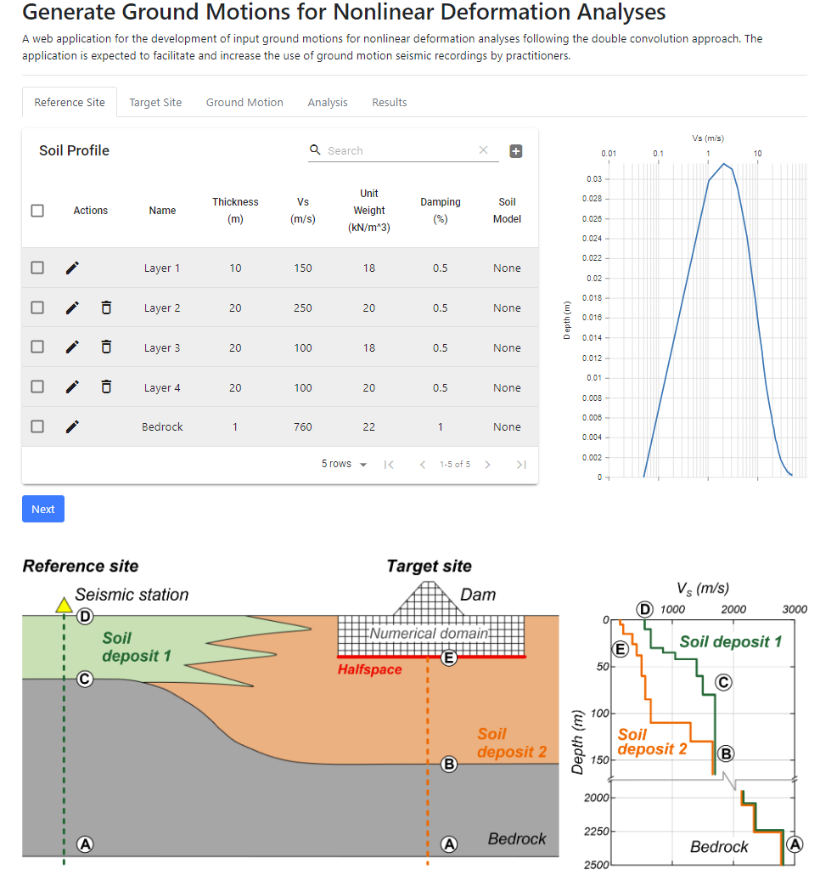

[Double Convolution Web APP](https://doubleconvolution.iitd.ac.in/)
=========

### Description

CSMIP is a web application for developing input ground motions for nonlinear deformation analyses using the double convolution approach. The application is expected to facilitate and increase the use of ground motion seismic recordings by practitioners.

## Acknowledgements

This web tool uses the **pyStrata** Python package (Kottke, 2019) to conduct site response calculations.  
We thank Dr. Albert R. Kottke for his support with pyStrata during the development of this project.

The development of this web tool was funded under agreement No. 1020‑007 between UC Davis and the Department of Conservation for the California Strong Motion Instrumentation Program (CSMIP) Data Interpretation Project:

> “Broadening the Utilization of CSMIP Data: Double Convolution Methodology Towards Developing Input Motions for Site Response and Nonlinear Deformation Analyses.”
> 

### Contact
We appreciate hearing from users, so please do send us an email (skssinha at ucdavis.edu, rpretell at ucdavis.edu, or kziotopoulou at ucdavis.edu) and let us know about your applications and experiences. Interested readers are referred to the publications below for details about the background and applications.

## References

- Pretell R., Sinha S.K., Ziotopoulou K., Watson‑Lamprey J.A. (2021).  
  *Broadening the utilization of CSMIP data: Double convolution methodology towards developing input motions for site response and nonlinear deformation analyses.*  
  Proceedings of SMIP 2021 Seminar on Utilization of Strong‑Motion Data (SMIP21), California Geological Survey.

- Pretell R., Ziotopoulou K., Abrahamson N. (2019).  
  *Methodology for the development of input motions for nonlinear deformation analyses.*  
  Proceedings of 7th International Conference on Earthquake Geotechnical Engineering (ICEGE), Rome, Italy.

---
Created by: [Sumeet Kumar Sinha](http://www.sumeetksinha.com), [Renmin Pretell](https://www.linkedin.com/in/rpretelld/), and [Katerina Ziotopoulou](https://cee.engineering.ucdavis.edu/directory/katerina-ziotopoulou)
Request for adding features on sumeet.kumar507@gmail.com, Renmin.Pretell@gmail.com, or kziotopoulou@ucdavis.edu
